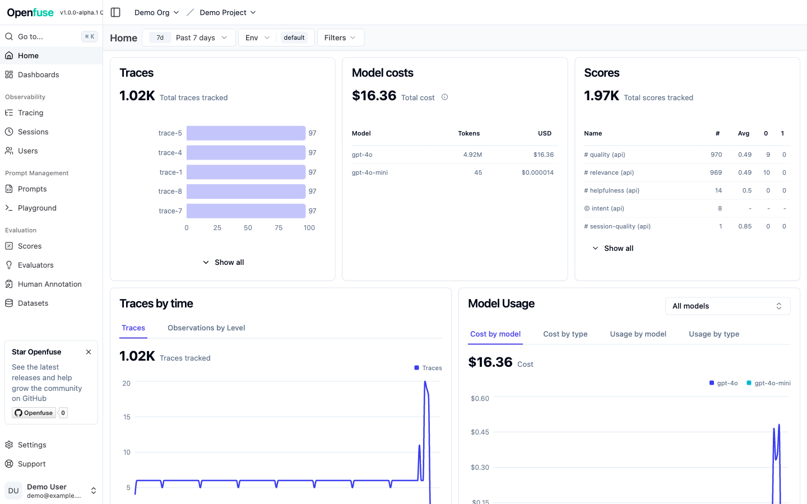
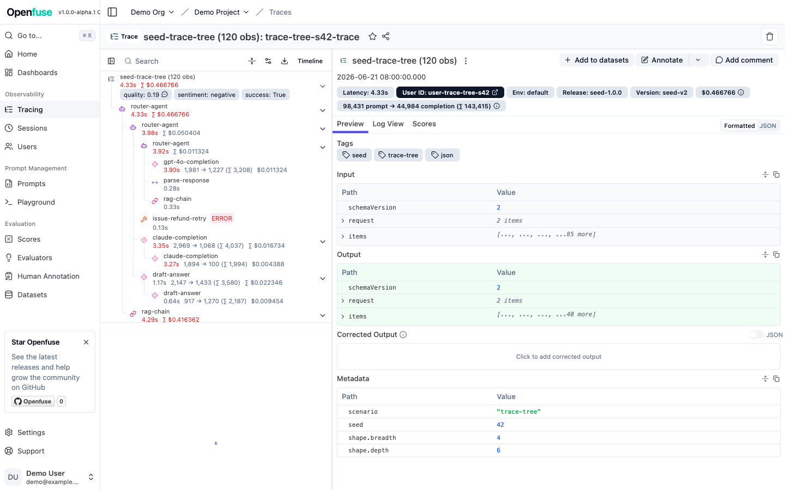
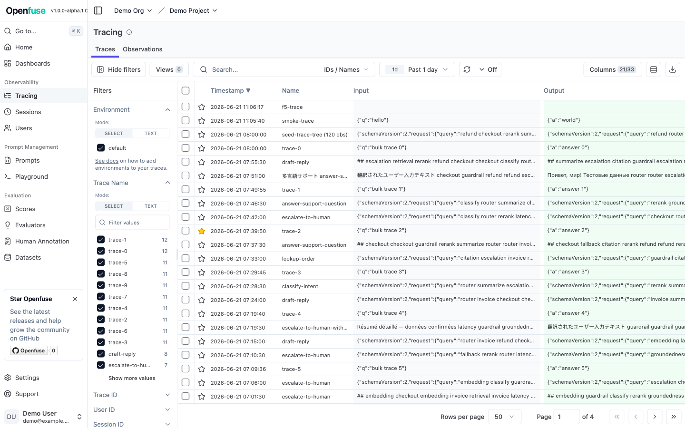
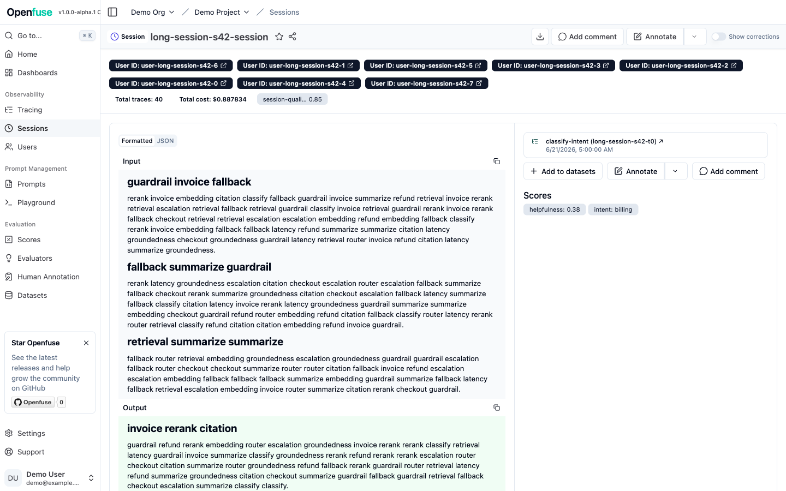

<div align="center">

<picture>
  <source media="(prefers-color-scheme: dark)" srcset="resources/openfuse_logo_dark.png" />
  
</picture>

### LLM engineering on a real observability database

[](https://github.com/tma1-ai/openfuse/releases)
[](https://hub.docker.com/r/tma1ai/openfuse-standalone)
[](docs/known-limitations.md)
[](LICENSE)
[](https://github.com/langfuse/langfuse)

[Quickstart](#5-minute-quickstart-docker-compose) · [Deployment](docs/deployment.md) · [Operations](docs/operations.md) · [Architecture](docs/architecture.md) · [Known limitations](docs/known-limitations.md) · [中文](README.zh.md)

</div>

Openfuse is a fork of [Langfuse](https://github.com/langfuse/langfuse) that swaps the analytics store from ClickHouse to [GreptimeDB](https://github.com/GreptimeTeam/greptimedb). The Langfuse product, public APIs, and SDKs stay the same; GreptimeDB becomes the source of truth for traces, observations, scores, and the analytics behind dashboards.

## Why GreptimeDB

LLM traces are observability data: timestamped wide events with high-cardinality context. That is exactly [GreptimeDB](https://docs.greptime.com/user-guide/concepts/why-greptimedb)'s data model. GreptimeDB is a unified observability database — metrics, logs, and traces in one engine, SQL and PromQL/TQL queryable, OTLP-native, with compute–storage separation over object storage. Running Langfuse on it, instead of on a single-purpose columnar store, buys two things today:

- **Start small, scale as you grow.** Begin with a single `openfuse-standalone` container — the GreptimeDB-standalone analogue. GreptimeDB persists to local disk or object storage, and the same engine scales from one node to a cluster as your data grows; scaling down loses no data. Object storage is optional: ingestion needs no S3 or MinIO.
- **Cheap long retention.** Object-storage-native tiered storage plus a plain-SQL database TTL (`LANGFUSE_GREPTIME_TTL`) make multi-month or multi-year retention affordable — a sore point for ClickHouse-backed Langfuse, where configurable data retention is an Enterprise feature. The TTL here is deployment-wide, not per-project.

It also opens a direction that a single-purpose store cannot. Because the events already live in a real observability database, GreptimeDB could take Openfuse **beyond** Langfuse parity: PromQL-native metrics, logs ↔ traces correlation, OTLP-native ingestion, and Flow continuous aggregation for pre-computed rollups. These are **directional and not delivered** — tracked as ideas in [issue #8](https://github.com/tma1-ai/openfuse/issues/8), not features you can use today.

## Screenshots

The full Langfuse UI, served entirely from GreptimeDB.

<table>
  <tr>
    <td width="50%"><br/><sub>Home dashboard — traces, model cost, scores, latency analytics</sub></td>
    <td width="50%"><br/><sub>Trace detail — nested observation tree</sub></td>
  </tr>
  <tr>
    <td width="50%"><br/><sub>Traces list</sub></td>
    <td width="50%"><br/><sub>Session view</sub></td>
  </tr>
</table>

## What works today

- **Your Langfuse SDKs work unchanged.** Point any existing Langfuse SDK — or any OpenTelemetry tracer — at Openfuse, and your traces, observations, and scores land with zero code changes.
- **The full tracing UI.** Explore traces and nested observations, sessions, and users, with the same search and filtering you have in Langfuse.
- **Dashboards and metrics.** Cost, token usage, latency percentiles, and score analytics — filtered and broken down by metadata, tags, and tools. Covered parity cases match upstream Langfuse; intentional differences are documented in the [parity report](docs/greptimedb-migration/parity/PARITY-REPORT.md).
- **Datasets, experiments, and evals.** The evaluation workflow works end to end.
- **Edit, delete, and export.** UI edits, deletions, and data exports behave as you'd expect, including full project deletion.
- **Self-host in one container.** The standalone image brings up the whole stack and prepares its storage on first start — no manual database steps.

## 5-minute quickstart (Docker Compose)

Requirements: Docker and Docker Compose. The quickest path is the published single `openfuse-standalone` image — web + worker in one process — wired to Postgres, Redis, and GreptimeDB. Both schemas migrate automatically on startup; object storage is off by default.

```bash
git clone https://github.com/tma1-ai/openfuse.git
cd openfuse
cp .env.quickstart.example .env
OPENFUSE_STANDALONE_IMAGE=tma1ai/openfuse-standalone:1.0.0-alpha.2 \
  docker compose -f docker-compose.standalone.yml up -d --pull always
```

Open <http://localhost:3000>. The quickstart env auto-creates a demo project, so you can log in as `demo@example.com` / `langfuse-dev` or point any Langfuse SDK at the bundled keys (`pk-lf-1234567890` / `sk-lf-1234567890`) right away. Those values are insecure dev defaults — for a real deployment start from `.env.prod.example` and set your own secrets, including a GreptimeDB password (`GREPTIME_PASSWORD`) to turn on enforced auth on the analytics store. Full guide: [deployment](docs/deployment.md).

To build the standalone image from the checkout instead of pulling the published image:

```bash
docker compose -f docker-compose.standalone.yml up -d
```

### Split web + worker

To scale web and worker independently, use the default `docker-compose.yml` (separate `openfuse-web` and `openfuse-worker` images) instead:

```bash
OPENFUSE_WEB_IMAGE=tma1ai/openfuse-web:1.0.0-alpha.2 \
OPENFUSE_WORKER_IMAGE=tma1ai/openfuse-worker:1.0.0-alpha.2 \
  docker compose up -d --pull always
```

## Project status

Openfuse is in **alpha** and actively moving toward beta. The ClickHouse → GreptimeDB migration is in place, the read path is parity-checked byte-for-byte against upstream Langfuse, and the full Langfuse product, API, and SDK surface works. Try it, run real workloads against it, and open issues — that feedback is what gets it to beta.

Before you depend on it, skim [Known limitations](docs/known-limitations.md): a short list of real constraints, plus a few intentional differences from upstream where the fork is equal or more correct.

## Published images

Release images are published to Docker Hub on each `v*` tag:

- [`tma1ai/openfuse-web`](https://hub.docker.com/r/tma1ai/openfuse-web)
- [`tma1ai/openfuse-worker`](https://hub.docker.com/r/tma1ai/openfuse-worker)
- [`tma1ai/openfuse-standalone`](https://hub.docker.com/r/tma1ai/openfuse-standalone) — web + worker in one container, for single-node self-hosting

The current preview is `1.0.0-alpha.2`. To run the standalone image instead of building locally, pin a tag in `.env`:

```bash
OPENFUSE_STANDALONE_IMAGE=tma1ai/openfuse-standalone:1.0.0-alpha.2
```

and start with:

```bash
docker compose -f docker-compose.standalone.yml up -d --pull always
```

Full instructions for standalone, split web/worker images, and tag policy: [deployment](docs/deployment.md#published-images-and-tags).

## Architecture

Postgres holds application and config data (users, projects, prompts, dataset definitions, API keys), unchanged from upstream Langfuse. GreptimeDB is the analytics event store: an append-only `raw_events` table as the source of truth, plus merged projection tables and indexed EAV side-tables that back metadata, tag, and tool filtering. Redis runs the BullMQ queues. Object storage (S3/MinIO) is optional for the default stack: media uploads, the OTel carrier, the eval blob store, and batch exports all default to local filesystem paths, so a stock deployment needs no bucket at all.

Full write-up: [architecture](docs/architecture.md).

## Compatibility with Langfuse

Openfuse `1.0.0-alpha.2` is based on upstream Langfuse `v3.184.1`. Existing Langfuse SDKs and the public ingestion/REST APIs work unchanged. Dashboard and metrics output is checked byte-for-byte against upstream for the covered query surface; the few intentional divergences, all cases where the fork is equal or more correct, are listed in the [parity ledger](docs/greptimedb-migration/parity/ledger.md). Postgres migrations are upstream Langfuse's and apply as-is; the GreptimeDB schema is fork-specific and migrates automatically on container startup (idempotent, advisory-lock serialised, fail-closed).

Openfuse is a community fork and is not affiliated with or endorsed by Langfuse. See [migration from Langfuse](docs/migration-from-langfuse.md) for the full compatibility statement.

## Documentation

- [Deployment](docs/deployment.md): self-host with Docker Compose, env, data directories, automatic migrations, standalone and published images.
- [Operations](docs/operations.md): monitoring, performance and compaction, capacity, backup and recovery, upgrades.
- [Development](docs/development.md): local setup, GreptimeDB schema, targeted tests.
- [Architecture](docs/architecture.md): what lives where, and why ClickHouse is gone.
- [Known limitations](docs/known-limitations.md): read before deploying.
- [Migration from Langfuse](docs/migration-from-langfuse.md): compatibility and what differs.
- [Design history](docs/greptimedb-migration/): the migration engineering record (design notes, reviews, parity harness).

## Contributing and security

See [CONTRIBUTING.md](CONTRIBUTING.md) to contribute, and [SECURITY.md](SECURITY.md) to report a vulnerability.

## License

This fork inherits upstream Langfuse licensing: the core is MIT; `ee/` is under the Langfuse EE license. Openfuse is a community fork of Langfuse and retains upstream copyright and attribution. See [LICENSE](LICENSE).
