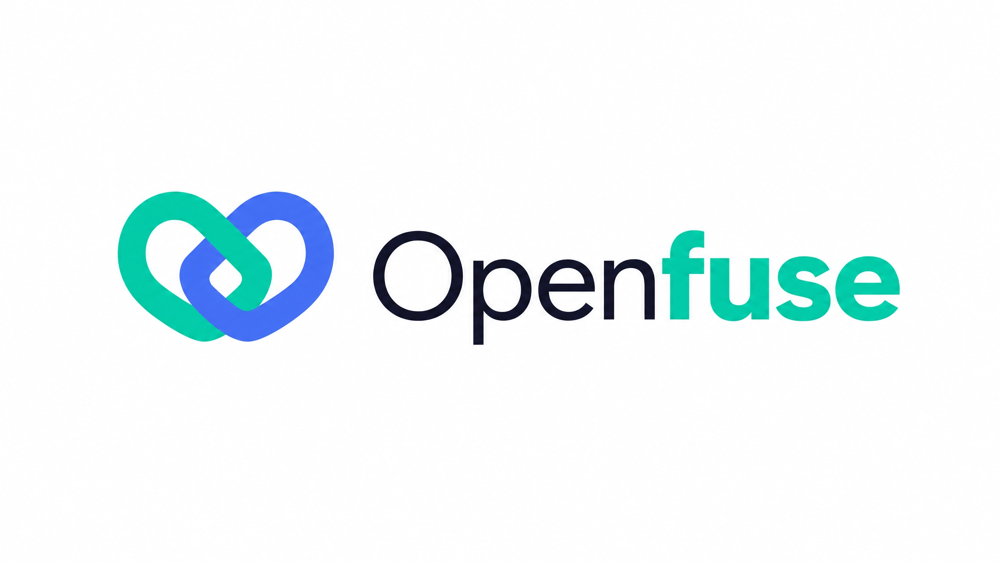

<div align="center">

<picture>
  <source media="(prefers-color-scheme: dark)" srcset="resources/openfuse_logo_dark.png" />
  
</picture>

### 把 LLM engineering 跑在一个真正的可观测性数据库上

[](https://github.com/tma1-ai/openfuse/releases)
[](docs/known-limitations.md)
[](LICENSE)
[](https://github.com/langfuse/langfuse)
[](https://github.com/GreptimeTeam/greptimedb)
[](https://github.com/tma1-ai/openfuse/stargazers)

[快速开始](#5-分钟快速开始docker-compose) · [部署](docs/deployment.md) · [运维](docs/operations.md) · [架构](docs/architecture.md) · [已知限制](docs/known-limitations.md) · [English](README.md)

</div>

Openfuse 是 [Langfuse](https://github.com/langfuse/langfuse) 的一个 fork，把分析存储从 ClickHouse 换成了 [GreptimeDB](https://github.com/GreptimeTeam/greptimedb)。Langfuse 的产品、公共 API 和 SDK 都保持不变；GreptimeDB 成为 traces、observations、scores 以及 dashboard 背后分析数据的 source of truth。

## 为什么是 GreptimeDB

LLM trace 本质就是可观测性数据：带高基数上下文的、带时间戳的宽事件（wide events）。这正好是 [GreptimeDB](https://docs.greptime.com/user-guide/concepts/why-greptimedb) 的数据模型。GreptimeDB 是一个统一的可观测性数据库——metrics、logs、traces 一个引擎，SQL 和 PromQL/TQL 都能查，OTLP 原生，存算分离、底层基于对象存储。把 Langfuse 跑在它上面（而不是绑死在一个单用途的列存上），今天就能拿到两点好处：

- **从单机起步，随规模 scale。** 先用一个 `openfuse-standalone` 容器跑起来——这是 GreptimeDB standalone 的对应物。GreptimeDB 数据落在本地磁盘或对象存储上，同一套引擎能随数据增长从单节点扩到集群，缩容也不丢数据。对象存储是可选的：ingestion 不需要 S3 或 MinIO。
- **便宜的长周期保留。** object-storage-native 的分层存储，加上一条纯 SQL 的整库 TTL（`LANGFUSE_GREPTIME_TTL`），让数月乃至数年的保留成本可控——这是 ClickHouse 版 Langfuse 的一个痛点，而在 Langfuse 里可配置的数据保留是 Enterprise 功能。注意这里的 TTL 是 deployment 级、整库一刀切，不是 per-project。

它还打开了单用途存储给不了的方向。因为事件本来就存在一个真正的可观测性数据库里，GreptimeDB 有可能把 Openfuse 带到 Langfuse parity **之外**：PromQL 原生的 metrics、logs ↔ traces 关联、OTLP 原生 ingestion、用 Flow 做预聚合 rollup。这些都是**方向性的、尚未交付**——作为想法记录在 [issue #8](https://github.com/tma1-ai/openfuse/issues/8)，不是今天能用的功能。

## 今天可用的能力

- **Ingestion**：公共 ingestion API 和 OTel endpoint 写入 `raw_events`，worker 把完整事件历史 replay 成合并后的 projection。
- **读取**：traces、observations、scores、sessions、dashboard 和 metrics、datasets、experiments、daily metrics、export，以及公共 GET 端点，全部从 GreptimeDB 读。
- **Dashboard**：metrics 查询引擎跑在 GreptimeDB 上，包括 metadata、tag、tool 的 filter 和 breakdown。输出与上游 Langfuse 做了逐字节比对（见 [parity report](docs/greptimedb-migration/parity/PARITY-REPORT.md)）。
- **变更、删除、replay**：UI 编辑和删除会向 `raw_events` 追加 synthetic 事件，replay 会重建合并后的（或软删的）状态，而不是复活或丢失数据。
- **自动迁移**：web 和 standalone 容器在启动时自动迁移 Postgres 和 GreptimeDB 两套 schema——不需要手动 bootstrap。

## 项目状态

Openfuse 处于 **alpha**，正在向 beta 推进。ClickHouse → GreptimeDB 的迁移已经落地，读路径与上游 Langfuse 做了逐字节 parity 校验，Langfuse 的完整产品、API、SDK 面都能用。欢迎直接上手、拿真实负载跑、提 issue——这些反馈正是推动它走向 beta 的动力。

在依赖它之前，建议先扫一眼[已知限制](docs/known-limitations.md)：一份真正的约束清单，外加少数与上游有意的差异（这些差异里 fork 都是等价或更正确的一侧）。

## 5 分钟快速开始（Docker Compose）

需要 Docker 和 Docker Compose。最快的方式是单个 `openfuse-standalone` 容器——web + worker 跑在一个进程里——再接上 Postgres、Redis、GreptimeDB。两套 schema 在启动时自动迁移，对象存储默认关闭。

```bash
git clone https://github.com/tma1-ai/openfuse.git
cd openfuse
cp .env.quickstart.example .env                        # working dev defaults — no edits needed
docker compose -f docker-compose.standalone.yml up -d  # 一个 app 容器 + Postgres/Redis/GreptimeDB
```

打开 <http://localhost:3000>。quickstart 的 env 会自动创建一个 demo project，所以你可以直接用 `demo@example.com` / `langfuse-dev` 登录，或者把任意 Langfuse SDK 指向内置的 key（`pk-lf-1234567890` / `sk-lf-1234567890`）。这些是不安全的 dev 默认值——正式部署请从 `.env.prod.example` 出发、自己生成 secret，并为分析存储设置 GreptimeDB 密码（`GREPTIME_PASSWORD`）以开启强制鉴权。完整指南见[部署文档](docs/deployment.md)。

### 拆分 web + worker

要让 web 和 worker 独立扩缩，改用默认的 `docker-compose.yml`（`langfuse-web` 和 `langfuse-worker` 两个独立镜像）：

```bash
docker compose up -d   # builds web/worker, starts the full stack
```

## 已发布镜像

每打一个 `v*` tag，CI 会把发布镜像推到 Docker Hub：

- [`tma1ai/openfuse-web`](https://hub.docker.com/r/tma1ai/openfuse-web)
- [`tma1ai/openfuse-worker`](https://hub.docker.com/r/tma1ai/openfuse-worker)
- [`tma1ai/openfuse-standalone`](https://hub.docker.com/r/tma1ai/openfuse-standalone)——web + worker 一个容器，用于单机自托管

首个预览版是 `1.0.0-alpha.1`。要直接跑 standalone 发布镜像而不是本地 build，在 `.env` 里固定一个 tag（例如 `OPENFUSE_STANDALONE_IMAGE=tma1ai/openfuse-standalone:1.0.0-alpha.1`），再用 `docker compose -f docker-compose.standalone.yml up -d --pull always` 启动。standalone、split web/worker 镜像和 tag 策略的完整说明见[部署文档](docs/deployment.md#published-images-and-tags)。

## 架构

Postgres 存应用和配置数据（users、projects、prompts、dataset 定义、API key），与上游 Langfuse 一致。GreptimeDB 是分析事件存储：一个 append-only 的 `raw_events` 表作为 source of truth，加上合并后的 projection 表，以及给 metadata/tag/tool filter 用的带索引 EAV 旁表。Redis 跑 BullMQ 队列。默认栈不需要对象存储（S3/MinIO）：media 上传、OTel carrier、eval blob store 默认走本地文件系统。可选的 batch/blob export 仍然需要 S3-compatible bucket。

完整说明见[架构文档](docs/architecture.md)。

## 与 Langfuse 的兼容性

Openfuse `1.0.0-alpha.1` 基于上游 Langfuse `v3.184.1`。现有 Langfuse SDK 和公共 ingestion/REST API 保持不变。Dashboard 和 metrics 输出在覆盖到的查询面上与上游做了逐字节比对；少数有意的差异——都是 fork 等价或更正确的情形——列在 [parity ledger](docs/greptimedb-migration/parity/ledger.md)。Postgres 迁移就是上游 Langfuse 的、原样套用；GreptimeDB schema 是 fork 特有的，在容器启动时自动迁移（幂等、advisory lock 串行、fail-closed）。

Openfuse 是社区 fork，与 Langfuse 没有从属关系、也未获其背书。完整兼容性声明见[从 Langfuse 迁移](docs/migration-from-langfuse.md)。

## 文档

- [部署](docs/deployment.md)：用 Docker Compose 自托管、env、自动迁移、standalone 与发布镜像。
- [运维](docs/operations.md)：监控、性能与 compaction、容量、备份与恢复、升级。
- [开发](docs/development.md)：本地搭建、GreptimeDB schema、定向测试。
- [架构](docs/architecture.md)：什么数据放在哪，以及为什么不再用 ClickHouse。
- [已知限制](docs/known-limitations.md)：部署前请先读。
- [从 Langfuse 迁移](docs/migration-from-langfuse.md)：兼容性与差异。
- [设计历史](docs/greptimedb-migration/)：迁移的工程记录（设计笔记、review、parity harness）。

## 贡献与安全

参与贡献见 [CONTRIBUTING.md](CONTRIBUTING.md)，报告漏洞见 [SECURITY.md](SECURITY.md)。

## 许可证

本 fork 沿用上游 Langfuse 的许可：核心是 MIT；`ee/` 走 Langfuse EE 许可。Openfuse 是 Langfuse 的社区 fork，保留上游版权与署名。见 [LICENSE](LICENSE)。
